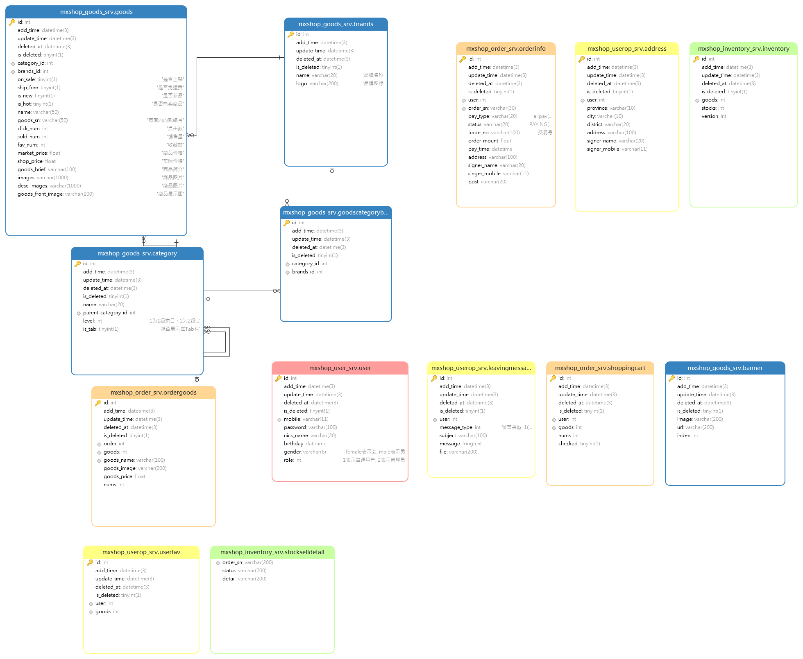
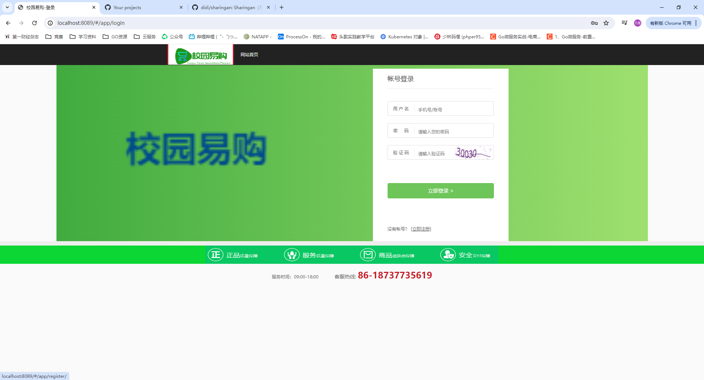
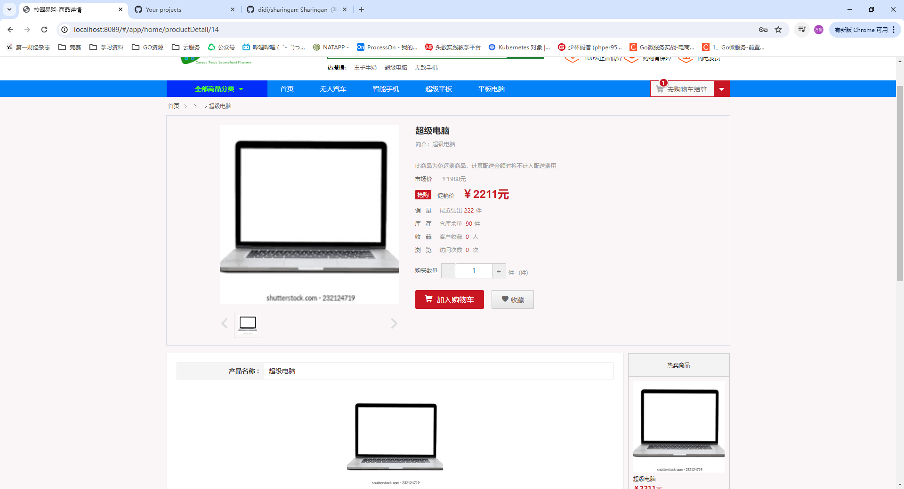
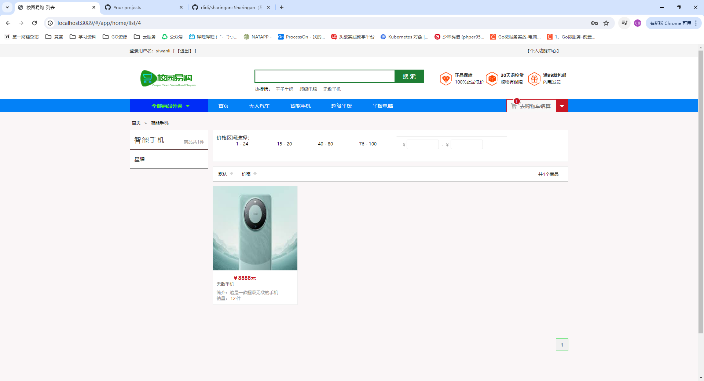
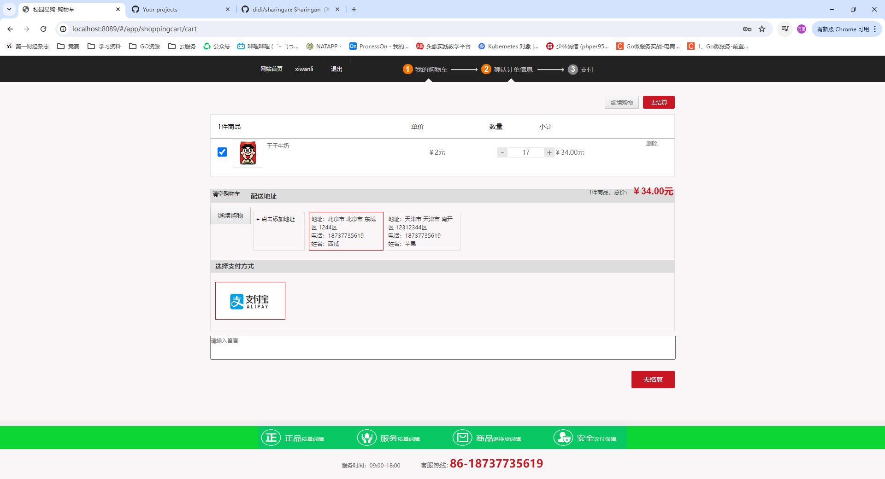
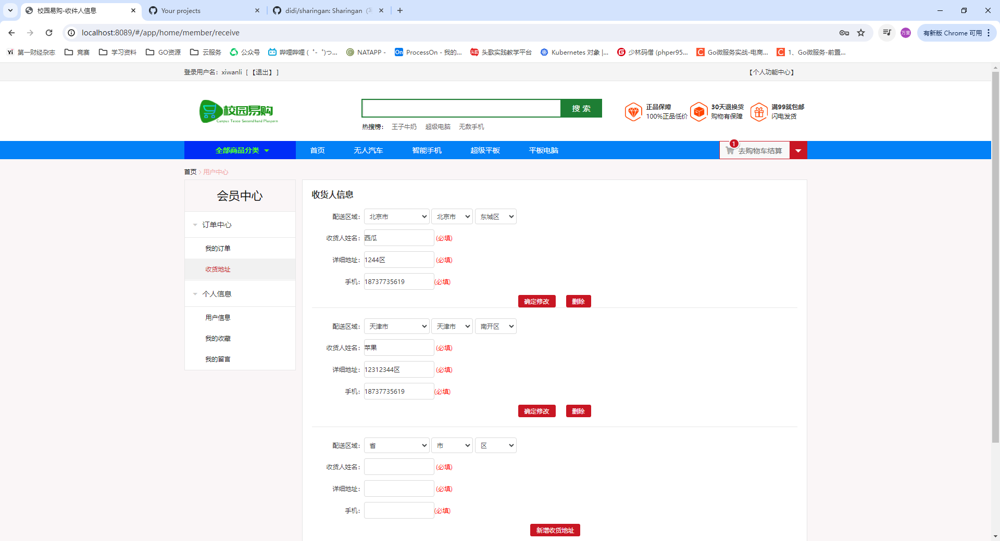
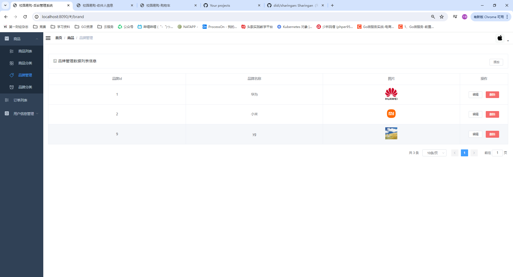
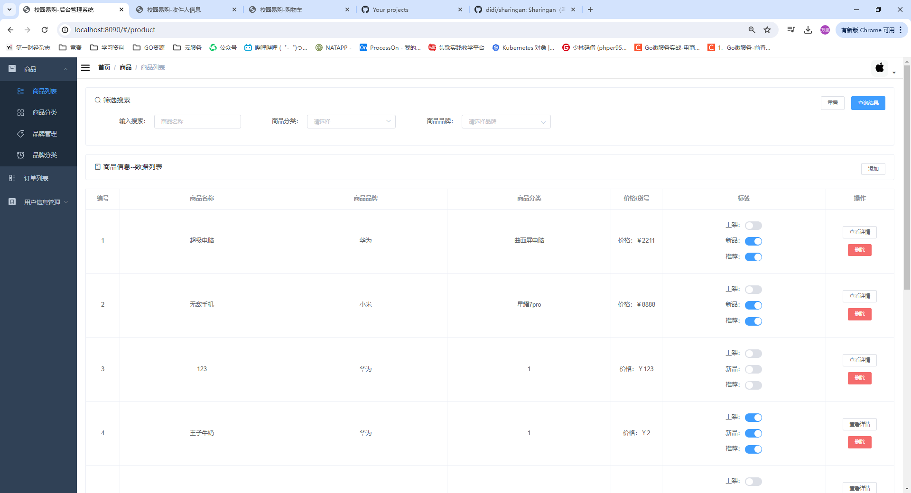

# 校园易购二手平台系统


## 一、技术栈简介

采用微服务架构的方式来写这个系统的相关功能，包括用户服务、商品服务、库存服务等等。

- Golang  1.22.3
- Gin
- Mysql 8.0
- Redis
- Nodejs 14.21.3（建议使用14.21.3下载，并且使用淘宝镜像）
- Vue
- gRPC
- Consul
- Nacos

## 二、快速开始

### 1、安装本系统使用到的插件，这里推荐使用docker安装，此操作皆在ubuntu系统下操作，如果是其他系统只需要修改一下命令即可。

1、docker安装Mysql8.0

2、docker安装Redis

3、docker安装Nacos

4、docker安装Consul

5、docker安装：Elasticsearch、kibana及ik的安装

**搭建系统详解网址：** https://blog.csdn.net/m0_73337964/article/details/139523540

### 2、前端的配置

采用vue搭建一套后台管理系统和一套电商系统。

1、获取vue所需要的依赖：

```
npm insatll
```

2、启动vue项目：

```
npm run dev
```

### 3、后端的配置

1、protobuf的配置

我已经把文件复制到docs/protobuf文件下了，把他们直接复制到你的go安装目录的bing文件夹下即可。

然后在每一个文件目录下的proto文件下，在终端输入(生成所需要的proto文件)：

```
protoc --go_out=. --go-grpc_out=. *.proto
```

2、修改`config-pro.yaml`文件里面的信息为nacos的模式即可。

3、最后，在每一个还有main.go的目录下进行终端启动：

```
go mod tidy
go build
./xxx.exe
```

注：这里我是打算写一个脚本一键启动的，但是还没完成，后续会修改的。

### 4、启动

此时，前端和后端都已经启动了，就可以点开浏览器去测试一下了。

http://xxxxxxxx:8089

http://xxxxxx:8090

## 三、数据库设计



## 四、核心系统功能

### 1 用户功能

- **登录**
  - **图形验证码**：采用Go语言的图形验证码库，防止恶意登录和暴力破解。通过Redis缓存验证码，提高了系统响应速度，使用户在高峰期依然能够快速登录。
- **注册**
  - **短信验证**：使用阿里云SMS服务发送短信验证码，确保用户注册的真实性。利用Redis缓存短信验证码，提高验证过程的响应速度，降低了注册时的延迟。
- **JWT鉴权**
  - **安全认证**：采用JWT进行用户身份验证和授权，确保通信安全。无状态认证模式，减轻了服务器的负载，提高了系统的扩展性和响应速度。
- **用户删除功能**
  - **权限控制**：只有管理员可以删除用户，确保操作的安全性和数据的完整性。
  - **逻辑删除**：使用逻辑删除标记，保留数据以备审计和恢复，避免数据丢失。
- **用户详细信息**
  - **信息展示**：展示用户的基本信息、历史订单和收藏商品等详细数据，为用户提供全面的个人信息视图。
  - **数据安全**：对敏感信息进行加密和保护，确保用户隐私和数据安全。

### 2 用户操作功能

- **订单地址**
  - **地址管理**：用户可以添加、修改和删除收货地址，方便用户随时更新地址信息，提高用户体验。
  - **默认地址**：支持设置默认收货地址，简化用户下单流程，提高购物体验的便捷性。
- **用户收藏记录**
  - **商品收藏**：用户可以收藏感兴趣的商品，方便日后查看和购买，提高用户粘性和回访率。
  - **收藏夹管理**：支持批量管理收藏的商品，提升用户操作的便捷性和效率。
- **客户的留言及评论**
  - **留言板**：用户可以在商品页面留言，询问商品详情或发布评论，增强用户互动。

### 3 库存服务

- **库存管理**
  - **实时库存更新**：根据订单和退货情况实时更新库存数据，确保数据准确。通过RocketMQ处理库存更新请求，保证在高并发场景下系统的性能和可靠性。
  - **预警机制**：当库存低于预设阈值时，自动触发预警。
  - **分布式锁**：采用Redis分布式锁，防止超卖现象，确保库存操作的原子性和一致性，提高数据的准确性。
- **订单超时管理**
  - **订单过期**：未支付订单超过设定时间自动取消，并恢复库存。通过消息队列发布延迟消息，确保订单超时处理的及时性。
  - **通知机制**：订单即将过期时提醒用户，减少订单取消率，提升订单完成率和用户满意度。

### 4 商品服务

- **商品展示**
  - **分类展示**：展示热门商品、新品推荐、特价商品等分类信息，提升用户购物体验。
  - **高性能**：利用缓存和异步加载技术，确保页面加载速度快。通过整合Sentinel，实现流量控制和熔断降级，确保系统在高并发情况下的稳定性，减少页面加载时间，提升用户体验。
- **搜索功能**
  - **Elasticsearch集成**：采用Elasticsearch实现高效的商品搜索和过滤功能，支持全文搜索、模糊搜索、筛选和排序等高级功能，提升搜索结果的相关性和准确性。

### 5 订单服务

- **订单管理**
  - **订单创建**：用户下单后，生成订单记录并扣减库存。使用分布式事务管理确保订单创建和库存扣减的一致性，减少订单生成的延迟，提高订单处理效率。
  - **订单状态**：支持订单状态的多种变更，如待支付、已支付、已发货、已完成、已取消等，通过消息队列实现订单状态的异步更新，减少订单状态变更的延迟。
- **支付集成**
  - **支付方式**：采用支付宝支付。

### 6 系统架构

- **gRPC微服务**
  - **高效通信**：采用gRPC框架进行微服务间的通信，具有高性能和低延迟的特点，提升系统的响应速度。
  - **接口定义**：使用Protocol Buffers定义服务接口和消息格式，确保跨语言的兼容性和高效的序列化性能。
  - **负载均衡**：集成负载均衡机制，分散请求压力，提高系统的可用性和稳定性，减少系统响应时间。
- **服务发现**
  - **Consul**：使用Consul进行服务注册和发现，确保各微服务之间的互联互通，提高系统的可靠性和可扩展性。
  - **Nacos：**使用Nacos进行配置文件信息，做到了配置信息的动态更改，提高了实际操作的效率。
  - **健康检查**：定期检查服务的健康状态，及时发现和处理故障服务，提高系统的稳定性和可靠性。

## 五、效果演示

#### 前台商城系统












#### 后端管理系统





## 六、可能出现的问题

1、在使用oss服务的时候可能出现服务未发现的问题，这是因为oos的回调服务必须是公网IP，如果你用的本地计算机，那么就需要内网穿透解决。

2、在使用阿里云支付的回调服务同上，也许哟啊内网穿透。

3、使用ubuntu系统，在本地可能无法访问虚拟机的IP地址或者连接不上，请修改虚拟机为桥接模式。

4、前端在npm insatll的时候报错，请看错误信息，出现错误的极大概率就是本地的微软运行库不全，那你自己在网上找一个修复一下就可了。

## 七、最后

感谢大家观看我的内容。


